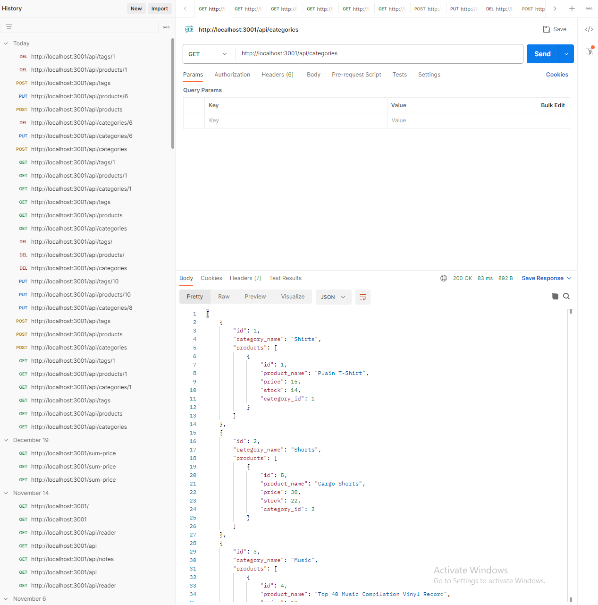

# E-Commerce Backend
    
## Description
    
This project is a way to empower businesses and consumers to conveniently engage in online buying and selling of products. Giving the business the power to get all of their products, categories, and tags, in their database, and to be able to create, update, and delete specified items.

## Screenshot

    
## Table of Contents
    
- [Installation](#installation)
- [Usage](#usage)
- [License](#license)
- [How to Contribute](#contributing)
- [Test](#test)
- [Questions](#questions)
    
## Installation
    
To install the application and dependencies, begin my running the 'npm i' command in the terminal to install dependencies. Next login to your mysql profile and perform the command 'source db/schema.sql;' to create your database. Finally start your server by performing the 'node server.js' command.
    
## Usage
    
To fetch all categories, products, and tags, perform a get operation in the appropriate url and you will get all data regarding each topic. To create one of these topics, go to the appropriate url and perform a post operation with a body matching the data from that model. To update, perform a put operation to the specified url with the id of the desired product, category, tag, as the parameter, and put the desired updated data in the body. To delete, perform a delete operation with the id of the desired topic in the url as the parameter.

## Link to Walkthrough Video

https://youtu.be/EWd7owM4218
    
## License
    
MIT License
    
## Contributing
    
N/A
    
## Test
    
N/A
    
## Questions
    
My Github account is [GitHub.com/midasantiago](github.com/midasantiago)
    
If you wish to contact me you can do so at mida.santiago98@gmail.com
